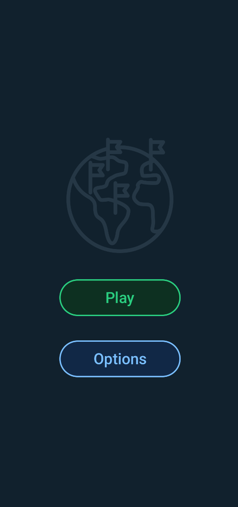
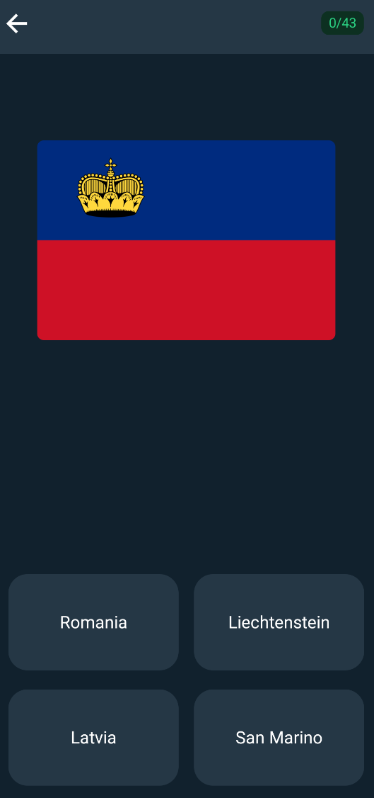

# World Flags Quiz 🌎

An Android app intended for learning all the world's flags!

## Flags

Flags from UN member states included. UN flags listed from UN [here](https://www.un.org/en/about-us/member-states). As of March 2025, there is a total of 193 UN member state flags.

## Definitions

Continents are defined by geographical continent, learn more [here](https://en.wikipedia.org/wiki/Continent).

## Links

* Abbreviations of the world's continents: [here](https://planetarynames.wr.usgs.gov/Abbreviations) (`AF, AN, AS, EU, NA, OC, SA`)
* Android Studio emulator bug fix: [here](https://stackoverflow.com/questions/42816127/waiting-for-target-device-to-come-online)
* Android Studio disable "show logcat automatically": [here](https://stackoverflow.com/questions/76118961/how-to-prevent-android-studio-to-automatically-switch-to-run-tab-when-i-start)
* Android Studio, format code: [here](https://stackoverflow.com/questions/16580171/code-formatting-shortcuts-in-android-studio-for-operation-systems)

## Acknowledgements

- The flag on the app icon in this project is from [Gitlab B.V.](https://gitlab.com/gitlab-org/gitlab-svgs/-/tree/main) and under the MIT License.
- Arrow icons (`ic_action_arrow_left.webp` & `ic_action_arrow_right.webp`) by [Android icons](https://www.androidicons.com/) is licensed under CC BY-SA 4.0.
- The image "Nationality icons" (`im_globe_flags.webp`), created by [Uniconlabs - Flaticon](https://www.flaticon.com/free-icons/nationality).
